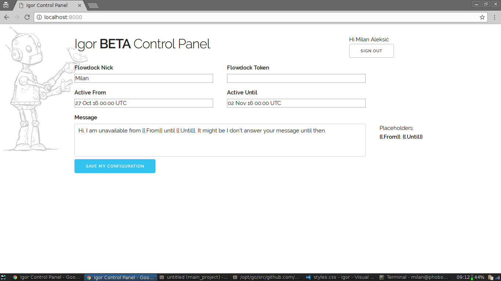
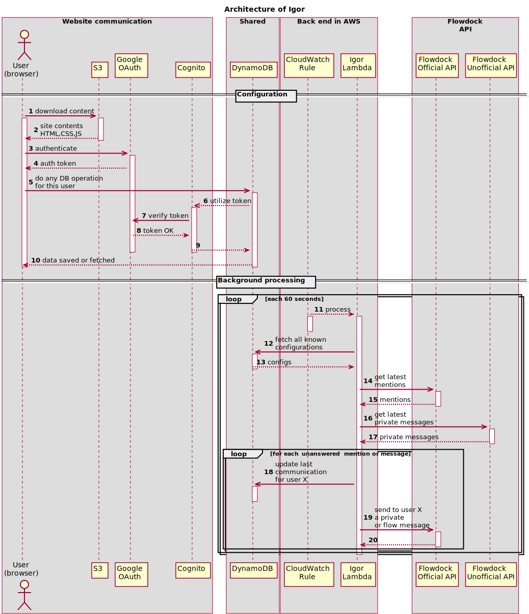

# Igor

This is a Flowdock bot. It uses AWS DynamoDB and AWS Lambda to check 
if there are new mentions and it responds to them if the date is between some
values stored in DynamoDB configuration.

## How to

### ... deploy

Unfortunately we have to work with Cognito which is not supported by CloudFormation,
so we have to split the work 

0. Make sure you have:
    - Docker installed;
    - an AWS account;
    - client ID of a Google+ API approved Google Dev Console application;
    - a Flowdock account (optional, unless you really want to use it and not just experiment with it).
1. rename `personal.env.template` to `personal.env` and introduce adequate values, as explained in it
2. run `cmd/main/cf/non_supported_pre.sh` to update the `personal.env`
3. deploy to AWS with `make form`
4. run `cmd/main/cf/non_supported_post.sh` to update the `personal.env` with the values from CloudFormation (step 3)

From this point on you can modify HTML and do `make deploy-site` to replace the cloud.

Other things you want to do are like:
- update function only with `make lambda-update`
- invoke directly via `make lambda-invoke`

### ... configure

Open the `index.html` which should be in the S3 and login using your Google credentials. Configure the application. **Profit**

## How does it work

I've drawn a small UML diagram explaining how it all works in case you want to use or extend it:

